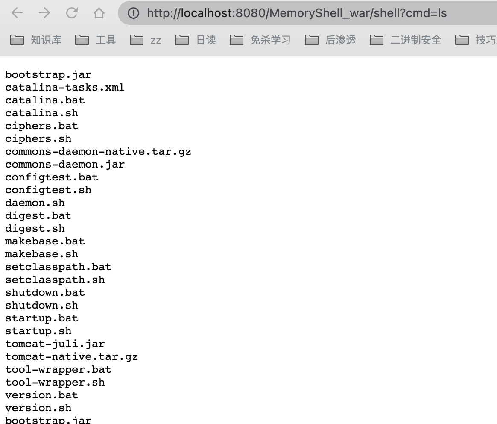
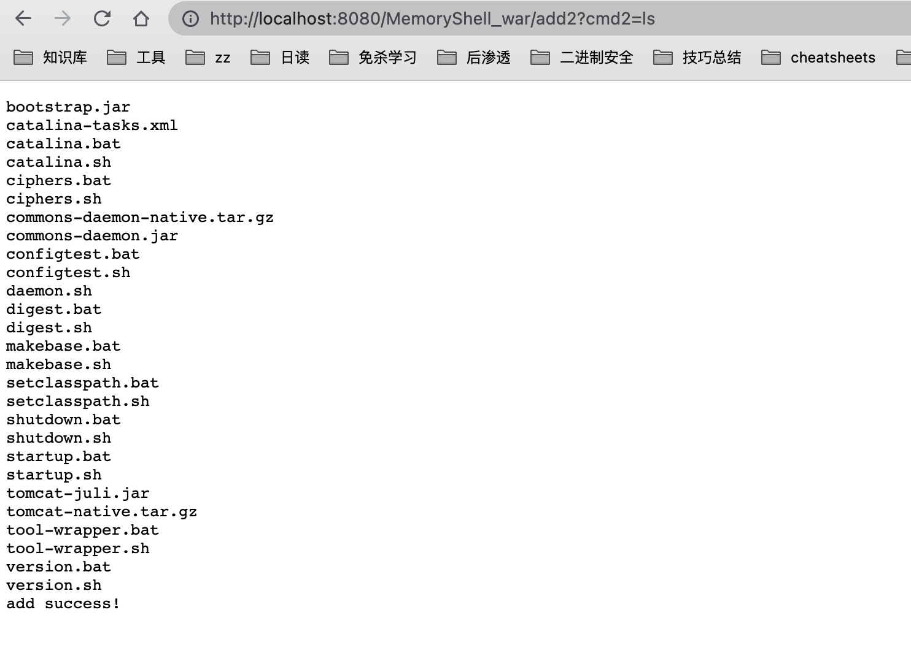

# MemoryShell
内存马学习，持续更新。

# 目录

## 文章
- [java内存马分析(一) 环境搭建](https://mp.weixin.qq.com/s/4Bz6UQzC6SEnjSPC4W5fyQ)
- [java内存马分析(二) Servlet内存马](https://mp.weixin.qq.com/s/VLc5TmTAuCttS_DhUSdBuw)
- [java内存马分析(三) Filter内存马](https://mp.weixin.qq.com/s/OWH42PojsFGO4fHSsUJhnw)
- [java内存马分析(四) Listener内存马](https://mp.weixin.qq.com/s/wNa8kR1t1KmyhItC_GmGQA)
- controller内存马已完成，文章待定
- interceptor内存马已完成，文章待定
- weblogic内存马已完成，文章待定

## servlet内存马
原理：
创建servlet马封装成wrapper，获取StandardContext使用addChild添加内存马，最后配置映射关系。
详细步骤见代码。

## filter内存马
原理： 
三个关键对象
- filterMaps变量：包含所有过滤器的URL映射关系
- filterDefs变量：包含所有过滤器包括实例内部等变量
- filterConfigs变量：包含所有与过滤器对应的filterDef信息及过滤器实例，进行过滤器进行管理   
 
步骤:创建filter马，然后filterDef包装，standardContext利用addFilterDef添加filterDefs，然后配置filterMap映射关系，最后filterDef加到filterConfig
详细步骤见代码。

## listener内存马
原理：
创建listener马，获取StandardContext使用addApplicationEventListener添加内存马。
详细步骤见代码。

# 挖掘思路
- 通过正向添加，然后从分析上下文。找对应存储的变量，分析对象构成。然后结合反射进行动态注册。
- 分析正向添加底层实现原理，然后结合反射实现动态注册。
